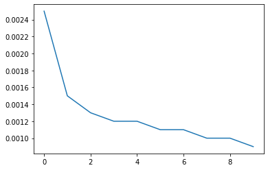
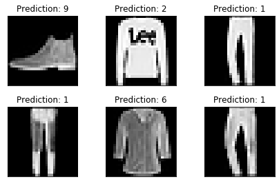

# Batch Normalization
In a nutshell, the idea in Batch Normalization is to transform the activation at a given layer from $\mathbf{x}$ to

$$\mathrm{BN}(\mathbf{x}) = \mathbf{\gamma} \odot \frac{\mathbf{x} - \hat{\mathbf{\mu}}}{\hat\sigma} + \mathbf{\beta}$$
Here, $\hat{\mathbf{\mu}}$ is the estimate of the mean and $\hat{\mathbf{\sigma}}$ is the estimate of the variance. The result is that the activations are approximately rescaled to zero mean and unit variance. Since this may not be quite what we want, we allow for a coordinate-wise scaling coefficient $\mathbf{\gamma}$ and an offset $\mathbf{\beta}$. Consequently, the activations for intermediate layers cannot diverge any longer: we are actively rescaling them back to a given order of magnitude via $\mathbf{\mu}$ and $\sigma$. Intuitively, it is hoped that this normalization allows us to be more aggressive in picking large learning rates. To address the fact that in some cases the activations may actually need to differ from standardized data, BN also introduces scaling coefficients $\mathbf{\gamma}$ and an offset $\mathbf{\beta}$.

In principle, we might want to use all of our training data to estimate the mean and variance. However, the activations correpsonding to each example change each time we update our model. To remedy this problem, BN uses only the current minibatch for estimating $\hat{\mathbf{\mu}}$ and $\hat\sigma$. It is precisely due to this fact that we normalize based only on the currect batch that batch normalization derives its name. To indicate which minibatch $\mathcal{B}$ we draw this from, we denote the quantities with $\hat{\mathbf{\mu}}_\mathcal{B}$ and $\hat\sigma_\mathcal{B}$.

$$\hat{\mathbf{\mu}}_\mathcal{B} \leftarrow \frac{1}{|\mathcal{B}|} \sum_{\mathbf{x} \in \mathcal{B}} \mathbf{x}
\text{ and }
\hat{\mathbf{\sigma}}_\mathcal{B}^2 \leftarrow \frac{1}{|\mathcal{B}|} \sum_{\mathbf{x} \in \mathcal{B}} (\mathbf{x} - \mathbf{\mu}_{\mathcal{B}})^2 + \epsilon$$
Note that we add a small constant $\epsilon &gt; 0$ to the variance estimate to ensure that we never end up dividing by zero, even in cases where the empirical variance estimate might vanish by accident. The estimates $\hat{\mathbf{\mu}}_\mathcal{B}$ and $\hat{\mathbf{\sigma}}_\mathcal{B}$ counteract the scaling issue by using unbiased but noisy estimates of mean and variance. Normally we would consider this a problem. After all, each minibatch has different data, different labels and with it, different activations, predictions and errors. As it turns out, this is actually beneficial. This natural variation appears to act as a form of regularization, conferring benefits (as observed empirically) in mitigating overfitting. In other recent preliminary research, Teye, Azizpour and Smith, 2018 and Luo et al, 2018 relate the properties of BN to Bayesian Priors and penalties respectively. In particular, this sheds some light on the puzzle why BN works best for moderate sizes of minibatches in the range 50-100.

We are now ready to take a look at how batch normalization works in practice.

# Loss Function

# Prediction
