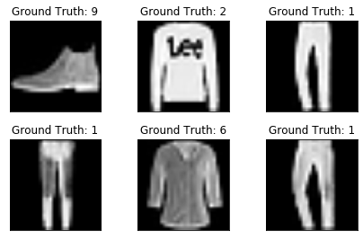
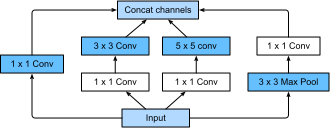
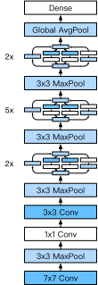
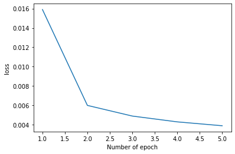

# Network with Parallel connection GoogleNet
The basic convolutional block in GoogLeNet is called an Inception block, likely named due to a quote from the movie Inception ("We Need To Go Deeper"), which launched a viral meme.
the inception block consists of four parallel paths. The first three paths use convolutional layers with window sizes of $1\times 1$, $3\times 3$, and $5\times 5$ to extract information from different spatial sizes. The middle two paths perform a $1\times 1$ convolution on the input to reduce the number of input channels, reducing the model's complexity. The fourth path uses a $3\times 3$ maximum pooling layer, followed by a $1\times 1$ convolutional layer to change the number of channels. The four paths all use appropriate padding to give the input and output the same height and width. Finally, the outputs along each path are concatenated along the channel dimension and comprise the block's output. The commonly-tuned parameters of the Inception block are the number of output channels per layer.
## Sample data Used 
Fashion MNSIT DataSet

## Inception block

## Google Net Structure

## network used
<code>
 Sequential(
  (0): Sequential(
    (0): Conv2d(1, 64, kernel_size=(7, 7), stride=(2, 2), padding=(3, 3))
    (1): ReLU()
    (2): MaxPool2d(kernel_size=3, stride=2, padding=1, dilation=1, ceil_mode=False)
  )
  (1): Sequential(
    (0): Conv2d(64, 64, kernel_size=(1, 1), stride=(1, 1))
    (1): ReLU()
    (2): Conv2d(64, 192, kernel_size=(3, 3), stride=(1, 1), padding=(1, 1))
    (3): MaxPool2d(kernel_size=3, stride=2, padding=1, dilation=1, ceil_mode=False)
  )
  (2): Sequential(
    (0): Inception(
      (p1_1): Conv2d(192, 64, kernel_size=(1, 1), stride=(1, 1))
      (p2_1): Conv2d(192, 96, kernel_size=(1, 1), stride=(1, 1))
      (p2_2): Conv2d(96, 128, kernel_size=(3, 3), stride=(1, 1), padding=(1, 1))
      (p3_1): Conv2d(192, 16, kernel_size=(1, 1), stride=(1, 1))
      (p3_2): Conv2d(16, 32, kernel_size=(5, 5), stride=(1, 1), padding=(2, 2))
      (p4_1): MaxPool2d(kernel_size=3, stride=1, padding=1, dilation=1, ceil_mode=False)
      (p4_2): Conv2d(192, 32, kernel_size=(1, 1), stride=(1, 1))
    )
    (1): Inception(
      (p1_1): Conv2d(256, 128, kernel_size=(1, 1), stride=(1, 1))
      (p2_1): Conv2d(256, 128, kernel_size=(1, 1), stride=(1, 1))
      (p2_2): Conv2d(128, 192, kernel_size=(3, 3), stride=(1, 1), padding=(1, 1))
      (p3_1): Conv2d(256, 32, kernel_size=(1, 1), stride=(1, 1))
      (p3_2): Conv2d(32, 96, kernel_size=(5, 5), stride=(1, 1), padding=(2, 2))
      (p4_1): MaxPool2d(kernel_size=3, stride=1, padding=1, dilation=1, ceil_mode=False)
      (p4_2): Conv2d(256, 64, kernel_size=(1, 1), stride=(1, 1))
    )
    (2): MaxPool2d(kernel_size=3, stride=2, padding=1, dilation=1, ceil_mode=False)
  )
  (3): Sequential(
    (0): Inception(
      (p1_1): Conv2d(480, 192, kernel_size=(1, 1), stride=(1, 1))
      (p2_1): Conv2d(480, 96, kernel_size=(1, 1), stride=(1, 1))
      (p2_2): Conv2d(96, 208, kernel_size=(3, 3), stride=(1, 1), padding=(1, 1))
      (p3_1): Conv2d(480, 16, kernel_size=(1, 1), stride=(1, 1))
      (p3_2): Conv2d(16, 48, kernel_size=(5, 5), stride=(1, 1), padding=(2, 2))
      (p4_1): MaxPool2d(kernel_size=3, stride=1, padding=1, dilation=1, ceil_mode=False)
      (p4_2): Conv2d(480, 64, kernel_size=(1, 1), stride=(1, 1))
    )
    (1): Inception(
      (p1_1): Conv2d(512, 160, kernel_size=(1, 1), stride=(1, 1))
      (p2_1): Conv2d(512, 112, kernel_size=(1, 1), stride=(1, 1))
      (p2_2): Conv2d(112, 224, kernel_size=(3, 3), stride=(1, 1), padding=(1, 1))
      (p3_1): Conv2d(512, 24, kernel_size=(1, 1), stride=(1, 1))
      (p3_2): Conv2d(24, 64, kernel_size=(5, 5), stride=(1, 1), padding=(2, 2))
      (p4_1): MaxPool2d(kernel_size=3, stride=1, padding=1, dilation=1, ceil_mode=False)
      (p4_2): Conv2d(512, 64, kernel_size=(1, 1), stride=(1, 1))
    )
    (2): Inception(
      (p1_1): Conv2d(512, 128, kernel_size=(1, 1), stride=(1, 1))
      (p2_1): Conv2d(512, 128, kernel_size=(1, 1), stride=(1, 1))
      (p2_2): Conv2d(128, 256, kernel_size=(3, 3), stride=(1, 1), padding=(1, 1))
      (p3_1): Conv2d(512, 24, kernel_size=(1, 1), stride=(1, 1))
      (p3_2): Conv2d(24, 64, kernel_size=(5, 5), stride=(1, 1), padding=(2, 2))
      (p4_1): MaxPool2d(kernel_size=3, stride=1, padding=1, dilation=1, ceil_mode=False)
      (p4_2): Conv2d(512, 64, kernel_size=(1, 1), stride=(1, 1))
    )
    (3): Inception(
      (p1_1): Conv2d(512, 112, kernel_size=(1, 1), stride=(1, 1))
      (p2_1): Conv2d(512, 144, kernel_size=(1, 1), stride=(1, 1))
      (p2_2): Conv2d(144, 288, kernel_size=(3, 3), stride=(1, 1), padding=(1, 1))
      (p3_1): Conv2d(512, 32, kernel_size=(1, 1), stride=(1, 1))
      (p3_2): Conv2d(32, 64, kernel_size=(5, 5), stride=(1, 1), padding=(2, 2))
      (p4_1): MaxPool2d(kernel_size=3, stride=1, padding=1, dilation=1, ceil_mode=False)
      (p4_2): Conv2d(512, 64, kernel_size=(1, 1), stride=(1, 1))
    )
    (4): Inception(
      (p1_1): Conv2d(528, 256, kernel_size=(1, 1), stride=(1, 1))
      (p2_1): Conv2d(528, 160, kernel_size=(1, 1), stride=(1, 1))
      (p2_2): Conv2d(160, 320, kernel_size=(3, 3), stride=(1, 1), padding=(1, 1))
      (p3_1): Conv2d(528, 32, kernel_size=(1, 1), stride=(1, 1))
      (p3_2): Conv2d(32, 128, kernel_size=(5, 5), stride=(1, 1), padding=(2, 2))
      (p4_1): MaxPool2d(kernel_size=3, stride=1, padding=1, dilation=1, ceil_mode=False)
      (p4_2): Conv2d(528, 128, kernel_size=(1, 1), stride=(1, 1))
    )
    (5): MaxPool2d(kernel_size=3, stride=2, padding=1, dilation=1, ceil_mode=False)
  )
  (4): Sequential(
    (0): Inception(
      (p1_1): Conv2d(832, 256, kernel_size=(1, 1), stride=(1, 1))
      (p2_1): Conv2d(832, 160, kernel_size=(1, 1), stride=(1, 1))
      (p2_2): Conv2d(160, 320, kernel_size=(3, 3), stride=(1, 1), padding=(1, 1))
      (p3_1): Conv2d(832, 32, kernel_size=(1, 1), stride=(1, 1))
      (p3_2): Conv2d(32, 128, kernel_size=(5, 5), stride=(1, 1), padding=(2, 2))
      (p4_1): MaxPool2d(kernel_size=3, stride=1, padding=1, dilation=1, ceil_mode=False)
      (p4_2): Conv2d(832, 128, kernel_size=(1, 1), stride=(1, 1))
    )
    (1): Inception(
      (p1_1): Conv2d(832, 384, kernel_size=(1, 1), stride=(1, 1))
      (p2_1): Conv2d(832, 192, kernel_size=(1, 1), stride=(1, 1))
      (p2_2): Conv2d(192, 384, kernel_size=(3, 3), stride=(1, 1), padding=(1, 1))
      (p3_1): Conv2d(832, 48, kernel_size=(1, 1), stride=(1, 1))
      (p3_2): Conv2d(48, 128, kernel_size=(5, 5), stride=(1, 1), padding=(2, 2))
      (p4_1): MaxPool2d(kernel_size=3, stride=1, padding=1, dilation=1, ceil_mode=False)
      (p4_2): Conv2d(832, 128, kernel_size=(1, 1), stride=(1, 1))
    )
    (2): AdaptiveMaxPool2d(output_size=(1, 1))
    (3): Flatten()
  )
  (5): Linear(in_features=1024, out_features=10, bias=True)
)
</code>

## Loss Vs Number Of epoch

## Prediction

