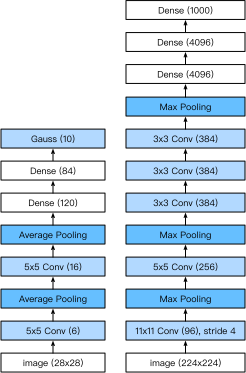

# Fashion-MNSIT-AlexNet-pytorch
In AlexNet’s first layer, the convolution window shape is 11 x 11. Since most images in ImageNet are more than ten times higher and wider than the MNIST images, objects in ImageNet data tend to occupy more pixels. Consequently, a larger convolution window is needed to capture the object. The convolution window shape in the second layer is reduced to 5x5, followed by 3x3. In addition, after the first, second, and fifth convolutional layers, the network adds maximum pooling layers with a window shape of 3 x 3 and a stride of 2. Moreover, AlexNet has ten times more convolution channels than LeNet.

After the last convolutional layer are two fully-connected layers with 4096 outputs. These two huge fullyconnected layers produce model parameters of nearly 1 GB. Due to the limited memory in early GPUs, the original AlexNet used a dual data stream design, so that each of their two GPUs could be responsible for storing and computing only its half of the model. Fortunately, GPU memory is comparatively abundant now, so we rarely need to break up models across GPUs these days (our version of the AlexNet model deviates from the original paper in this aspect).
## AlexNet Structure

## Sample data Used 
Fashion MNSIT DataSet

## network used
<code>
	net = nn.Sequential(
            nn.Conv2d(1, 96, kernel_size=11, stride=4, padding=1),
            nn.ReLU(inplace=True),
            nn.MaxPool2d(kernel_size=3, stride=2),
            nn.Conv2d(96, 256, kernel_size=5, padding=2),
            nn.ReLU(inplace=True),
            nn.MaxPool2d(kernel_size=3, stride=2),
            nn.Conv2d(256, 384, kernel_size=3, padding=1),
            nn.ReLU(inplace=True),
            nn.Conv2d(384, 384, kernel_size=3, padding=1),
            nn.ReLU(inplace=True),
            nn.Conv2d(384, 256, kernel_size=3, padding=1),
            nn.ReLU(inplace=True),
            nn.MaxPool2d(kernel_size=3, stride=2),
            Flatten(),
            nn.Dropout(p=0.5,inplace=True),
            nn.Linear(in_features=6400,out_features=4096),
            nn.ReLU(),
            nn.Dropout2d(p=0.5,inplace=True),
            nn.Linear(in_features=4096,out_features=4096),
            nn.ReLU(),
            nn.Linear(in_features=4096,out_features=10)
            )
</code>
